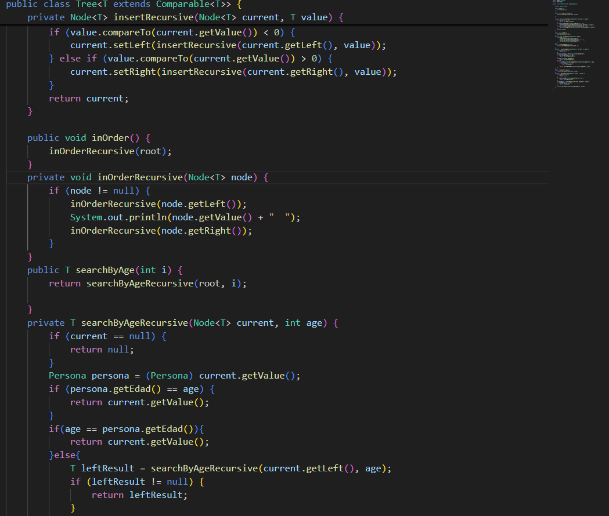
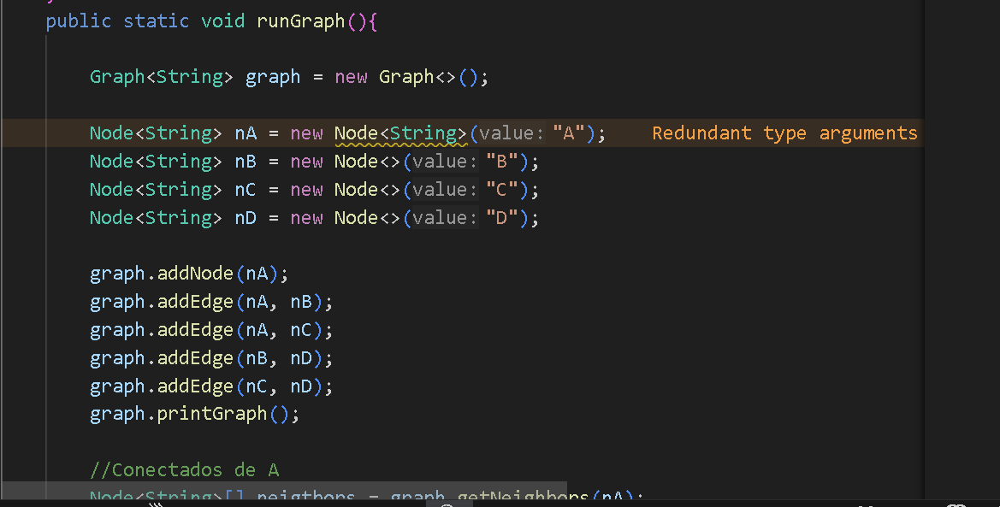

# Práctica: Estructuras No Lineales - 

## Autor
- Nombre: [Eduardo Ramon]
- Carrera/Curso: [Estructura]

##  Nombre de la práctica - Fecha
- Práctica: [Práctica de Árboles – Implementación Genéricos uso de interfaces Comparable]
- Fecha: [2026-01-06]

## Descripción
Implementar un Árbol Binario de Búsqueda genérico en Java usando:

Node<T>
Tree<T>
Object implements Comparable<Object>

## Evidencias
### Captura 1
Inserta aquí la captura del código o de la ejecución.
- Archivo: 

### Captura 2 
Inserta aquí una segunda captura si aplica.
- Archivo: 

### Captura 3
- Archivo :

### Captura 4
- Archivo :